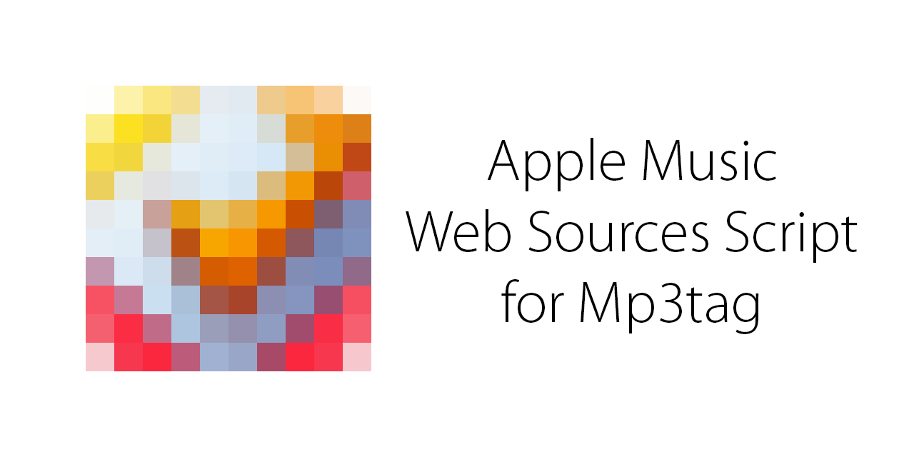

# Apple Music Web Sources Script for Mp3tag
> Forked from [jonaaa20/itunes-web-sources](https://github.com/jonaaa20/itunes-web-sources)

Automatically gather proper [ID3](https://id3.org) tags and download cover artworks from [Apple Music](https://music.apple.com) database for your music library.

## Installation

1. Download and install [Mp3tag](https://www.mp3tag.de/en/dodownload.html)

2. Download [Apple Music (US).src](https://raw.githubusercontent.com/ivadham/AppleMusicWebSources/master/Apple%20Music%20(US).src)

3. Press `Win+R`, type in `%APPDATA%\Mp3tag\data\sources` and click OK. Paste `Apple Music (US).src` there.

4. For more information, visit [Web sources framework](https://community.mp3tag.de/t/web-sources-framework/1633)

## How to Use
**(Files|Edit|View|Convert|Actions|`Tag Sources`|Tools|Help)**

1. Select all tracks of an album and choose `Apple Music (US)` from `Tag Sources`.

2. Enter Artist - Album and click Next.

3. Choose the one that best describes your album (Artist, Album, Explicitness, etc.)

4. Move up/Move down tracks to match their source and click OK.

5. BONUS: Mp3tag's "Tag - Filename" (`Alt+1`) can rename files based on their tag. Use the following placeholders: `%artist% - %title%`

## Credit
[pone](https://community.mp3tag.de/t/ws-itunes/13478) created iTunes Web Sources Script for Mp3Tag in 2012. dano, [JonaaaBR](https://github.com/jonaaa20/itunes-web-sources) and amine improved it.

## Legal
APPLE MUSIC WEB SOURCES SCRIPT FOR MP3TAG IS NOT AFFILIATED WITH APPLE